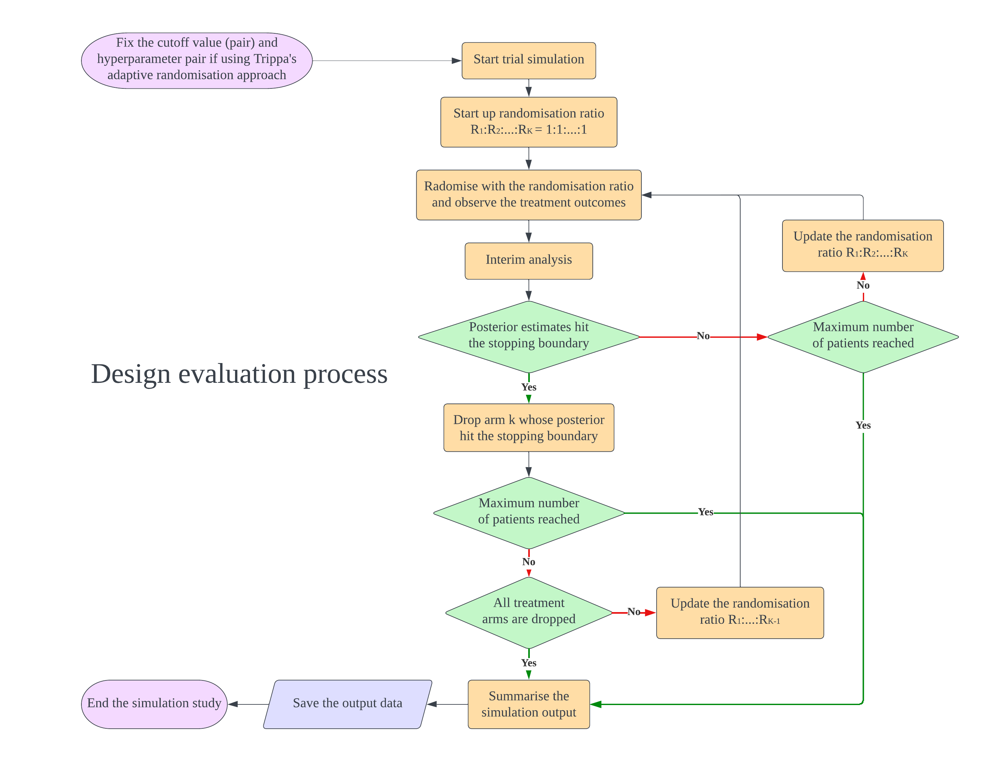

<!-- README.md is generated from README.Rmd. Please edit that file -->

# BayesianPlatformDesignTimeTrend

The goal of BayesianPlatformDesignTimeTrend is to simulates the
multi-arm multi-stage or platform trial with Bayesian approach using the
‘rstan’ package, which provides the R interface for to the stan. The
package uses Thall’s and Trippa’s randomisation approach for Bayesian
adaptive randomisation. In addition, the time trend problem of platform
trial can be studied in this package. There are a some demos for the
simulation process of cutoff screening, hyperprameter tuning and design
evaluation in this package.

## Installation

You can install the ‘BayesianPlatformDesignTimeTrend’ package 1.2.0 like
so:

``` r
# install.packages("BayesianPlatformDesignTimeTrend")
# devtools::install_github("ZXW834/BayesianPlatformDesignTimeTrend", build_vignettes = TRUE)
```

## Bayesian simulation process overview

In the design, $K$ intervention arms are evaluated compared to a shared
control. During the trial, there are several interim analyses for
decision making to claim superiority of each arm (Oneside test) or both
inferiority and superiority of each arm (Twoside test). There are
several parameters can be tuned which are cutoff values of stopping
boundaries and the hyperparameters of Trippa’s adaptive randomisation
approach. The below figures illustrate how to do design evaluation using
this package. We need to set up the design first and start with cutoff
screening to control the FWER and maximise the power. If the
investigator want to tune hyperparameters of Trippa’s approach to
maximise the power further, the randomisation method in cutoff screening
process should be adaptive randomisation (Eg.Thall’s approach). We found
that after fixing the cutoff value, the change of adaptive randomisation
method does not inflate the FWER. After finding the cutoff (and
hyperparameter), the design is fixed and can be evaluated. If
investigator wants to compare the design with different maximum sample
size, just use the same cutoff (and hyperparameter) and only change the
sample size parameter to create a new design for evaluation.


## Demo

-   `Demo_CutoffScreening()` is a demo function performing cutoff
    screening process where simple linear model is fit
-   `Demo_CutoffScreening_GP()` is a demo function performing cutoff
    screening process where Gaussian process is fit and active learning
    is used
-   `Demo_multiplescrenariotrialsimulation()` is a demo function
    performing MAMS trial simulation

## Tutorials

-   `MAMS-CutoffScreening-tutorial` is a tutorial document of how to do
    cutoff screening under Bayesian MAMS trial fitting linear model.
-   `MAMS-CutoffScreening-GP-Asymmetric-tutorial` is a tutorial document
    of how to do symmetric cutoff screening under Bayesian MAMS trial
    fitting the Gaussian process.
-   `MAMS-CutoffScreening-GP-Symmetric-tutorial` is a tutorial document
    of how to do asymmetric cutoff screening under Bayesian MAMS trial
    fitting the Gaussian process.
-   `MAMS-trial-simulation-tutorial` is a tutorial document of how to do
    Bayesian MAMS trial simulation with or without time trend.

## Example

This is a basic example which shows you how to solve a common problem:

``` r
# library(BayesianPlatformDesignTimeTrend)
## basic example code
```

``` r
output=Trial.simulation(ntrials = 10000,
trial.fun = simulatetrial,
 input.info = list(
   response.probs = c(0.4, 0.4),
   ns = c(60, 120, 180, 240, 300),
   max.ar = 0.75,
   rand.algo = "Urn",
   max.deviation = 3,
   model.inf = list(
     model = "tlr",
     ibb.inf = list(
       pi.star = 0.5,
       pess = 2,
       betabinomialmodel = ibetabinomial.post
     ),
     tlr.inf = list(
       beta0_prior_mu = 0,
       beta1_prior_mu = 0,
       beta0_prior_sigma = 2.5,
       beta1_prior_sigma = 2.5,
       beta0_df = 7,
       beta1_df = 7,
       reg.inf =  "main",
       variable.inf = "Fixeffect"
     )
   ),
   Stopbound.inf = Stopboundinf(
     Stop.type = "Early-Pocock",
       Boundary.type = "Symmetric",
         cutoff = c(0.9925, 0.0075)
         ),
   Random.inf = list(
     Fixratio = FALSE,
     Fixratiocontrol = NA,
     BARmethod = "Thall",
     Thall.tuning.inf = list(tuningparameter = "Fixed",  fixvalue = 1)
   ),
   trend.inf = list(
     trend.type = "step",
     trend.effect = c(0, 0),
     trend_add_or_multip = "mult"
   )
 ),
 cl = 2)
```

Here is the operational characteristics table for previous single null
scenario simulation.

``` r
output$OPC
```

``` r
#>  $OPC
#>                          Type.I.Error.or.Power       Bias        rMSE     N.per.arm.1
#>0404TimeTrend00stage5main                0.0444  0.0007538   0.3390904        146.4978
#>                          N.per.arm.2    Survive.per.arm.1    Survive.per.arm.2          N
#>0404TimeTrend00stage5main    146.7282               58.552              58.6241    293.226
```
